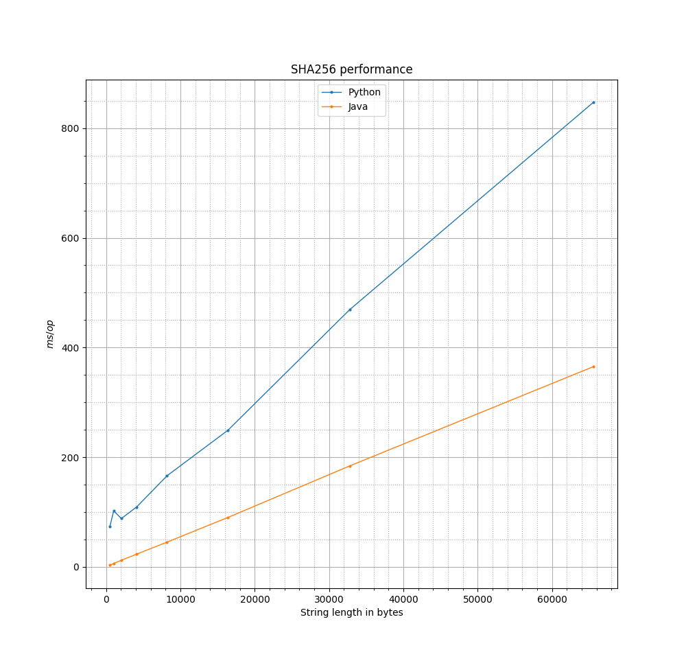

# BC Python Port
BC Python Port - это Python-интерфейс для криптографической библиотеки [Bouncy Castle](https://www.bouncycastle.org/).
> The Bouncy Castle project offers open-source APIs for Java, C# and Kotlin that support cryptography and cryptographic protocols.

Проект позволяет разрабатывать приложения, использующие все возможности Bouncy Castle, на языке Python.

Доступен в виде готового пакета на [TestPyPI](https://test.pypi.org/project/BCPython/).

## Содержание
- [Запуск](#запуск)
- [Генерация SBOM](#генерация-sbom)
- [Используемые инструменты](#используемые-инструменты)
- [Схема работы](#схема-работы)
- [Использование проекта](#использование-проекта)
- [Пример использования](#пример-использования)
- [Структура проекта](#структура-проекта)

## Запуск

> При разработке и тестировании были использованы указанные версии. При желании можно использовать другие версии, но работоспособность проекта не гарантируется.

Для сборки и последующего запуска необходимо
### Установить Python и pip, используются ``Python 3.12.3`` и ``pip 24.0``
Для debian-based дистрибутивов Linux
```
sudo apt install python3
```
Для Windows использовать установщик с [официального сайта](https://www.python.org/downloads/release/pymanager-250/) или установить из Microsoft Store. При использовании установщика выбрать **.msix** файл, а не .msi. \
Если не удаётся выполнить установку .msix обычным способом, то воспользоваться PowerShell:
```
Add-AppxPackage .\Downloads\python-manager-24.0.msix
python
```
### Установить зависимости для Python
Рекомендуется создать Python virtual environment и установить пакеты туда, чтобы всё хранилось в папке с проектом. Для этого из корневой папки проекта выполнить
```
python3 -m venv .venv
```
Активировать среду (в Linux)
```
source ./.venv/bin/activate
```
Активировать среду (в Windows, использовать PowerShell)
```
Set-ExecutionPolicy -ExecutionPolicy RemoteSigned -Scope CurrentUser
.\.venv\Scripts\Activate.ps1
```
Установить зависимости
```
pip install -r requirements.txt
```
### Установить Java (JDK), используется `openjdk 21.0.8 2025-07-15`
Для debian-based дистрибутивов Linux
```
sudo apt install openjdk-21-jdk
```
Для Windows использовать установщик c [официального сайта](https://www.oracle.com/java/technologies/downloads/?er=221886#jdk21-windows).
После этого из PowerShell добавить Java в PATH
```
$Env:PATH += ";C:\Program Files\Java\jdk-21\bin"
```

### Установить [Maven](https://maven.apache.org/install.html), используется `Apache Maven 3.8.7`

Для debian-based дистрибутивов Linux
```
sudo apt install maven
```
Для Windows скачать [Binary Distribution](https://maven.apache.org/download.cgi). Распаковать в корневую директорию проекта и оттуда добавить в PATH
```
$Env:PATH += ";.\apache-maven-3.8.7\bin"
```
### Собрать Java-часть с помощью maven
```
mvn package
```
### Собрать wheel & установить
```
pip install build
python3 -m build
pip install dist/bcpython-0.0.2-py3-none-any.whl
```
**При разработке** для того, чтобы не пересобирать пакет при каждом изменеии модулей, вместо этого
```
pip install -e .
```
### Запустить требуемый python-файл, например, ``examples/example-bc-rsa-sign-verify.py``
```
python3 examples/example-bc-rsa-sign-verify.py
```

## Генерация SBOM
- Для генерации SBOM требуется скачать `cyclonedx-cli` из официального [репозитория](https://github.com/CycloneDX/cyclonedx-cli/releases/tag/v0.29.1). Затем поместисть скачанный файл в корневую папку проекта.
- Активировать среду Python (см. п. Запуск)
- Для генерации SBOM в Linux *из корневой папки проекта* запустить ``generate_sbom.sh``.
```
chmod u+x generate_sbom.sh && ./generate_sbom.sh
```
- Для Windows *из корневой папки проекта* запустить в PowerShell ``generate_sbom.ps1``.
```
.\generate_sbom.ps1
```
Это создаст java-SBOM в папке ``./target`` и python-SBOM в корневой папке проекта, после чего объединит их в один файл ``sbom.json``

## Используемые инструменты
- **Maven** - система сборки Java-проектов, позволяющая удобно создавать .jar файлы, включающие в себя все зависимости, необходимые для работы программы (fat jar).  
- **py4j** - python-библиотека, позволяющая получать доступ к объектам Java из Python.
- **CycloneDX** (cyclonedx-python и cyclonedx-cli) - набор [инструментов](https://cyclonedx.org/capabilities/sbom/) для создания SBOM (Software Bill Of Materials) в формате OWASP CycloneDX.

## Схема работы
Для соединения Python и Java используется библиотека Py4j. Py4J позволяет программам на Python, запущенным в интерпретаторе Python, динамически обращаться к объектам Java на виртуальной машине Java. Методы вызываются так, как если бы объекты Java находились в интерпретаторе Python, а к коллекциям Java можно было бы получить доступ с помощью стандартных методов сбора данных Python. Py4J также позволяет Java-программам вызывать объекты Python.

Py4J — это мост между Python и Java, построенный на сетевом протоколе поверх TCP-сокета.
Python и JVM обмениваются сообщениями по сети (localhost:port). Не используются JNI (Java Native Interface), Jython, C-биндингов или shared memory — только TCP-соединение и сериализация данных.

```
+--------------------+             TCP socket              +---------------------+
|     Python side    |  <--------------------------------> |     Java side       |
|  py4j.java_gateway |     (by default 127.0.0.1:25333)    |  py4j.GatewayServer |
+--------------------+                                     +---------------------+
```

## Использование проекта

Библиотека предоставляет доступ к jvm которая может исполнять методы из java библиотеки bouncy castle.

- Доступ осуществляется через gateway, получаемый с помощью функции get_gatway<br>
> В модуле BCWrapper.py фукнция ``def get_gateway(timeout_seconds=30)`` создает подключение к Java если оно еще не создано, или возвращает объект подключения, если создано. Для защиты используется случайно генерирующийся при каждом создании соединения токен.

- По умолчанию java сервер поднимается через `java -jar ...`<br>
- С помощью функции `set_java_path` можно указать пользовательский путь до бинарного файла java.

По умолчанию методы bc-java возвращают JavaObject, над которым есть python обертка. То есть, делая операции над этим объектом, пользователь делает операции над объектом в jvm
> Исключение byte[], который сразу переводится в python bytes.

Целью было передать тяжелые вычисления в jvm, а потом использовать результаты в python. Чтобы сконвертировать JavaObject в соответствующий ему python объект в нашей библиотеке есть:
- `is_java_proxy`
- `java_collection_to_list`
- `java_map_to_dict`
- `java_enum_to_str`
- `java_bigdecimal_to_decimal`
- `java_biginteger_to_int`
- `java_to_py`

Это позволит избежать оверхеда на TCP передачу сериализованных сообщений для небольших операций.

## Пример использования
```
gw = get_gateway()

security = gw.jvm.java.security
Security = security.Security
BouncyCastleProvider = gw.jvm.org.bouncycastle.jce.provider.BouncyCastleProvider
Security.addProvider(BouncyCastleProvider())

text_bytes = "hash me please".encode("utf-8")

MessageDigest = security.MessageDigest
digest = MessageDigest.getInstance("SHA-256", "BC")
hash_bytes = digest.digest(text_bytes)
```

- Разберем этот пример:

`gw = get_gateway()` - **запуск JVM** с javа из path и получение интерфейса взаимодействия


- Добавление провайдера криптографических методов в java:
```
security = gw.jvm.java.security
Security = security.Security
BouncyCastleProvider = gw.jvm.org.bouncycastle.jce.provider.BouncyCastleProvider
Security.addProvider(BouncyCastleProvider())
```

`text_bytes = "hash me please".encode("utf-8")` - получение bytes из строки, от которой хотим посчитать sha256

- Получение объекта, который занимается хешированием. В Bouncy Castle такой же интерфейс.
```
MessageDigest = security.MessageDigest
digest = MessageDigest.getInstance("SHA-256", "BC")
hash_bytes = digest.digest(text_bytes)
```

где `type(hash_bytes) == <class 'bytes'>` из python (см. исключение в конвертации типов выше)

## Структура проекта
- `src/BCPython/` - Python-модули вместе с необходимыми файлами для сборки пакета
- `src/main/java/` - Java-файлы для запуска JVM-сервера Py4J
- `benchmarks/` -  Java и Python файлы для бенчмарков
- `examples/` - примеры использования библиотеки
- `img/` - графики бенчмарков
- `tests/` - Python-тесты пакета
- `generate_sbom.sh` - скрипт для герерации SBOM на Linux в формате JSON, продуктами работы являются `sbom-python.json`, `sbom.json`
- `generate_sbom.ps1` - скрпит для генерации SBOM на Windows
- `pyproject.toml` - файл с описанием Python-пакета
- `MANIFEST.in` - файл для системы сборки Python-пакета `setuptools`, включает необходиимые `.jar` файлы в пакет
- `pom.xml` - конфигурационный файл Maven
- `requirements.txt` - зависимости для Python


## Бенчмарки для оценки накладных расходов Py4j
Написан одинаковый код (хеширование строк разной длины с помощью алгоритма SHA256) c использованием Bouncy Castle на Java и с помощью нашего Python-интерфейса.
Для запуска Python бенчмарка нужно сделать следующее
```
cd benchmarks
python3 sha256benchmark.py
```
Для запуска Java бенчмарка
```
cd benchmarks
mvn package
mvn exec:java -Dexec.mainClass="benchmarks.Sha256Benchmark"
```

Получены следующие результаты. При коротких строках Python имеет фиксированные накладные расходы, так как, помимо вызовов Java методов, он интерпретирует код со своей стороны и осуществляет пересылка TCP пакетов. При длинных строках вклад от интерпретации становится ниже, на первый план выходят накладные расходы от пересылки TCP пакетов, поэтому наклон у Python-кривой больше.




System:
  Kernel: 5.15.0-91-generic x86_64 bits: 64 compiler: gcc v: 11.4.0
    Desktop: Cinnamon 6.0.4 Distro: Linux Mint 21.3 Virginia
    base: Ubuntu 22.04 jammy

CPU:
  Info: quad core model: Intel Core i5-1035G1 bits: 64 type: MT MCP
    arch: Ice Lake rev: 5 cache: L1: 320 KiB L2: 2 MiB L3: 6 MiB
Info:
  Memory: 7.44 GiB


turboboost OFF
governor performance
fixed CPU frequency 3000 MHz
