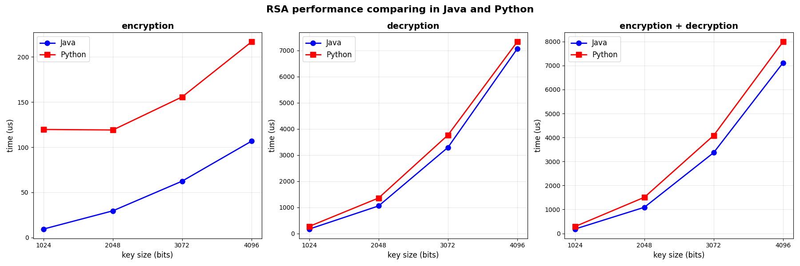
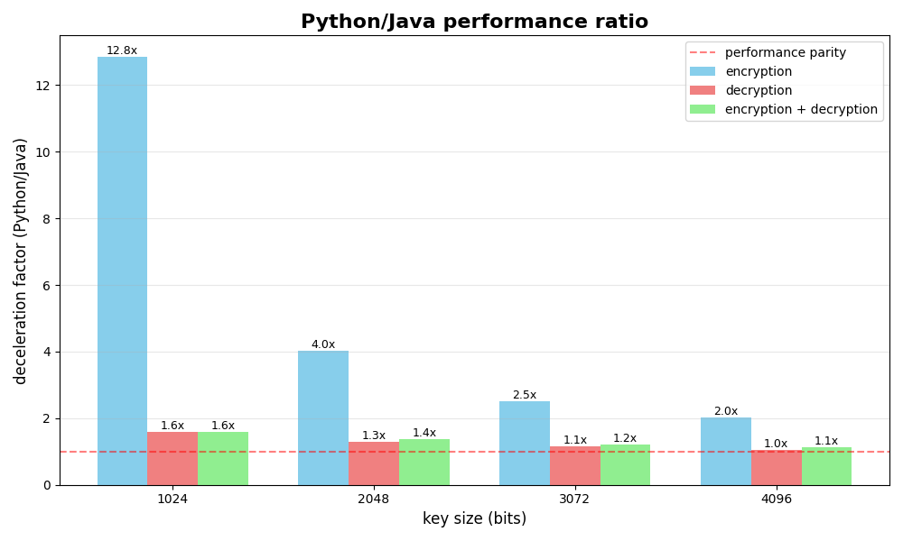

# BC Python Port
BC Python Port is a Python interface for the [Bouncy Castle](https://www.bouncycastle.org/) cryptographic library.
> The Bouncy Castle project offers open APIs for Java, C#, and Kotlin that support cryptography and cryptographic protocols.

The project allows you to develop applications that use all the features of Bouncy Castle in Python.

It is available as a ready-made package on [TestPyPI](https://test.pypi.org/project/BCPython/).

## Contents
- [Launch](#launch)
- [SBOM generation](#sbom-generation)
- [Tools used](#tools-used)
- [Workflow](#workflow)
- [Using the project](#using-the-project)
- [Example of use](#example-of-use)
- [Project structure](#project-structure)


## Launch

> The specified versions were used during development and testing. Other versions may be used if desired, but the project's functionality is not guaranteed.

To build and launch the project, you need to
### Install Python and pip, using ``Python 3.12.3`` and ``pip 24.0``
For Debian-based Linux distributions
```
sudo apt install python3
```
For Windows, use the installer from the [official website](https://www.python.org/downloads/release/pymanager-250/) or install from the Microsoft Store. When using the installer, select the **.msix** file, not .msi. \
If you cannot install .msix in the usual way, use PowerShell:
```
Add-AppxPackage .\Downloads\python-manager-24.0.msix
python
```
### Install dependencies for Python
It is recommended to create a Python virtual environment and install packages there so that everything is stored in the project folder. To do this, run the following command from the root folder of the project:
```
python3 -m venv .venv
```
Activate the environment (in Linux)
```
source ./.venv/bin/activate
```
Activate the environment (in Windows, use PowerShell)
```
Set-ExecutionPolicy -ExecutionPolicy RemoteSigned -Scope CurrentUser
.\.venv\Scripts\Activate.ps1
```
Install dependencies
```
pip install -r requirements.txt
```
### Install Java (JDK), use `openjdk 21.0.8 2025-07-15`
For Debian-based Linux distributions
```
sudo apt install openjdk-21-jdk
```
For Windows, use the installer from the [official website](https://www.oracle.com/java/technologies/downloads/?er=221886#jdk21-windows).
Then, add Java to PATH from PowerShell
```
$Env:PATH += “;C:\Program Files\Java\jdk-21\bin”
```

### Install [Maven](https://maven.apache.org/install.html), use `Apache Maven 3.8.7`

For Debian-based Linux distributions
```
sudo apt install maven
```
For Windows, download [Binary Distribution](https://maven.apache.org/download.cgi). Unpack it into the root directory of the project and add it to PATH from there
```
$Env:PATH += “;.\apache-maven-3.8.7\bin”
```
### Build the Java part using maven
```
mvn package
```
### Build wheel & install
```
pip install build
python3 -m build
pip install dist/bcpython-0.0.2-py3-none-any.whl
```
**When developing**, to avoid rebuilding the package every time you change modules, instead
```
pip install -e .
```
### Run the required python file, for example, ``examples/example-bc-rsa-sign-verify.py``
```
python3 examples/example-bc-rsa-sign-verify.py
```
## Generating SBOM
- To generate SBOM, you need to download `cyclonedx-cli` from the official [repository](https://github.com/CycloneDX/cyclonedx-cli/releases/tag/v0.29.1). Then place the downloaded file in the root folder of the project.
- Activate the Python environment (see Start).
- To generate SBOM in Linux, run `generate_sbom.sh` from the project root folder.
```
chmod u+x generate_sbom.sh && ./generate_sbom.sh
```
- For Windows, run ``generate_sbom.ps1`` in PowerShell *from the project root folder*.
```
.\generate_sbom.ps1
```
This will create a java-SBOM in the ``./target`` folder and a python-SBOM in the project root folder, then combine them into a single ``sbom.json`` file.

## Tools used
- **Maven** - a Java project build system that allows you to conveniently create .jar files that include all the dependencies necessary for the program to run (fat jar).
- **py4j** - a Python library that allows you to access Java objects from Python.
- **CycloneDX** (cyclonedx-python and cyclonedx-cli) - a set of [tools](https://cyclonedx.org/capabilities/sbom/) for creating SBOM (Software Bill Of Materials) in OWASP CycloneDX format.

## How it works
The Py4j library is used to connect Python and Java. Py4J allows Python programs running in the Python interpreter to dynamically access Java objects on the Java virtual machine. Methods are called as if the Java objects were in the Python interpreter, and Java collections can be accessed using standard Python data collection methods. Py4J also allows Java programs to call Python objects.

Py4J is a bridge between Python and Java built on a network protocol over a TCP socket.
Python and the JVM exchange messages over the network (localhost:port). No JNI (Java Native Interface), Jython, C bindings, or shared memory are used—only a TCP connection and data serialization.

```
+--------------------+             TCP socket              +---------------------+
|     Python side    |  <--------------------------------> |     Java side       |
|  py4j.java_gateway |     (by default 127.0.0.1:25333)    |  py4j.GatewayServer |
+--------------------+                                     +---------------------+
```

## Using the project

The library provides access to the JVM, which can execute methods from the Java library Bouncy Castle.

- Access is provided through a gateway obtained using the get_gatway function.
> In the BCWrapper.py module, the function ``def get_gateway(timeout_seconds=30)`` creates a connection to Java if it has not already been created, or returns the connection object if it has been created. A token that is randomly generated each time a connection is created is used for protection.

- By default, the Java server is launched via `java -jar ...`<br>
- Using the `set_java_path` function, you can specify a custom path to the Java binary file.

By default, bc-java methods return JavaObject, which has a Python wrapper. That is, when performing operations on this object, the user performs operations on the object in the JVM
> The exception is byte[], which is immediately converted to Python bytes.

The goal was to transfer heavy calculations to the JVM and then use the results in Python. To convert JavaObject to the corresponding Python object, our library has:
- `is_java_proxy`
- `java_collection_to_list`
- `java_map_to_dict`
- `java_enum_to_str`
- `java_bigdecimal_to_decimal`
- `java_biginteger_to_int`
- `java_to_py`

This will avoid the overhead of TCP transmission of serialized messages for small operations.

## Example
```
gw = get_gateway()

security = gw.jvm.java.security
Security = security.Security
BouncyCastleProvider = gw.jvm.org.bouncycastle.jce.provider.BouncyCastleProvider
Security.addProvider(BouncyCastleProvider())

text_bytes = "hash me please".encode("utf-8")

MessageDigest = security.MessageDigest
digest = MessageDigest.getInstance("SHA-256", "BC")
hash_bytes = digest.digest(text_bytes)
```

- Let's break down this example:

`gw = get_gateway()` - **launching the JVM** with Java from the path and obtaining the interaction interface


- Adding a cryptographic method provider in Java:
```
security = gw.jvm.java.security
Security = security.Security
BouncyCastleProvider = gw.jvm.org.bouncycastle.jce.provider.BouncyCastleProvider
Security.addProvider(BouncyCastleProvider())
```

`text_bytes = “hash me please”.encode(“utf-8”)` - obtaining bytes from the string from which we want to calculate sha256

- Obtaining an object that handles hashing. Bouncy Castle has the same interface.
```
MessageDigest = security.MessageDigest
digest = MessageDigest.getInstance("SHA-256", "BC")
hash_bytes = digest.digest(text_bytes)
```

where `type(hash_bytes) == <class ‘bytes’>` from Python (see the exception in type conversion above)

## Project structure
- `src/BCPython/` - Python modules along with the files needed to build the package
- `src/main/java/` - Java files for running the Py4J JVM server
- `benchmarks/` - Java and Python files for benchmarks
- `examples/` - examples of using the library
- `img/` - benchmark graphs
- `tests/` - Python tests for the package
- `generate_sbom.sh` - script for generating SBOM on Linux in JSON format, the output is `sbom-python.json`, `sbom.json`
- `generate_sbom.ps1` - script for generating SBOM on Windows
- `pyproject.toml` - file with a description of the Python package
- `MANIFEST.in` - file for the Python package build system `setuptools`, includes the necessary `.jar` files in the package
- `pom.xml` - Maven configuration file
- `requirements.txt` - dependencies for Python


## Benchmarks for evaluating Py4j overhead
The same code was written (hashing strings of different lengths using the SHA256 algorithm, encryption using RSA with different key lengths) using Bouncy Castle on Java and using our Python interface.
To run the Python benchmark, do the following
```
cd benchmarks
python3 sha256benchmark.py
```
To run the Java benchmark
```
cd benchmarks
mvn package
mvn exec:java -Dexec.mainClass=“benchmarks.Sha256Benchmark”
```

The following results were obtained. 

#### SHA256

For short strings, Python has fixed overhead costs because, in addition to calling Java methods, it interprets the code on its own and sends TCP packets. For long strings, the contribution from interpretation becomes lower, and the overhead costs from sending TCP packets come to the fore, which is why the slope of the Python curve is greater.


#### RSA
The complexity of RSA does not increase linearly with the length of the key, but we get results similar to SHA256: with short keys, the overhead costs are fixed, and as the keys increase, the slope of the Python curve is greater for the same reasons. We also see that with large keys, the ratio of Python performance to Java performance decreases (for example, expansion at 4096 has almost the same performance).






Conclusion: we have overhead costs associated with sending TCP packets, but with labor-intensive calculations, overhead costs become insignificant.

### Information about the machine on which the benchmarks were run
```
System:
  Kernel: 5.15.0-91-generic x86_64 bits: 64 compiler: gcc v: 11.4.0
    Desktop: Cinnamon 6.0.4 Distro: Linux Mint 21.3 Virginia
    base: Ubuntu 22.04 jammy

CPU:
  Info: quad core model: Intel Core i5-1035G1 bits: 64 type: MT MCP
    arch: Ice Lake rev: 5 cache: L1: 320 KiB L2: 2 MiB L3: 6 MiB
Info:
  Memory: 7.44 GiB


turboboost OFF
governor performance
fixed CPU frequency 3000 MHz
```
